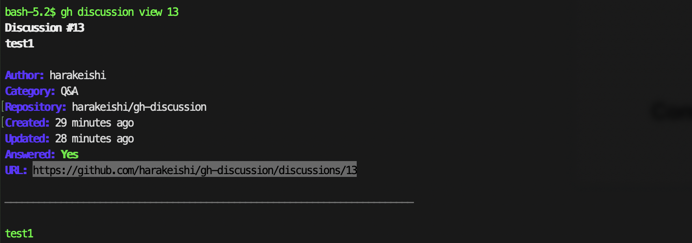

# gh-discussion

A GitHub CLI extension for managing discussions, providing functionality similar to `gh issue` and `gh pr` for GitHub Discussions.

English | [日本語](README_ja.md)

## Features

- **List discussions** with filtering and search capabilities
- **View discussion details** with optional comments
- **Multiple output formats**: table, JSON, custom templates
- **GitHub CLI integration**: uses your existing GitHub authentication

## Demo

### Listing discussions


### Viewing discussion details


### Viewing discussion with comments


## Installation

### Prerequisites

- [GitHub CLI](https://cli.github.com/) must be installed and authenticated
- Go 1.21 or later (for building from source)

### Install from source

```bash
git clone https://github.com/harakeishi/gh-discussion.git
cd gh-discussion
go build -o gh-discussion
gh extension install .
```

### Install as GitHub CLI extension

```bash
gh extension install harakeishi/gh-discussion
```

## Usage

### List discussions

```bash
# List discussions in the current repository
gh discussion list

# List discussions in a specific repository
gh discussion list -R owner/repo

# Filter by author
gh discussion list -a username

# Search discussions
gh discussion list -S "API documentation"

# Filter by category
gh discussion list --category "General"

# Filter by answered status
gh discussion list --answered true
gh discussion list --answered false

# Limit results
gh discussion list -L 50

# Output specific fields as JSON
gh discussion list --json "number,title,author,category,isAnswered"

# Open in web browser
gh discussion list -w
```

### View discussion details

```bash
# View discussion by number
gh discussion view 123

# View discussion in specific repository
gh discussion view 123 -R owner/repo

# View discussion by URL
gh discussion view https://github.com/owner/repo/discussions/123

# Include comments
gh discussion view 123 -c


# Output specific fields
gh discussion view 123 --json "title,body,author,comments"


# Open in web browser
gh discussion view 123 -w
```

## Available JSON Fields

### Discussion fields
- `activeLockReason`, `answer`, `answerChosenAt`, `answerChosenBy`
- `author`, `authorAssociation`, `body`, `bodyHTML`, `bodyText`
- `category`, `comments`, `createdAt`, `createdViaEmail`, `databaseId`
- `editor`, `id`, `includesCreatedEdit`, `isAnswered`, `lastEditedAt`
- `locked`, `number`, `publishedAt`, `reactionGroups`, `repository`
- `resourcePath`, `title`, `updatedAt`, `url`, `upvoteCount`
- `viewerCanDelete`, `viewerCanReact`, `viewerCanSubscribe`
- `viewerCanUpdate`, `viewerDidAuthor`, `viewerSubscription`

### Nested object fields

#### Author/User fields
- `avatarUrl`, `login`, `url`, `id`, `name`, `email`

#### Category fields
- `id`, `name`, `description`, `emoji`, `emojiHTML`, `isAnswerable`, `createdAt`, `updatedAt`

#### Comment fields
- `author`, `authorAssociation`, `body`, `bodyHTML`, `bodyText`, `createdAt`
- `id`, `isAnswer`, `isMinimized`, `minimizedReason`, `publishedAt`
- `reactionGroups`, `replies`, `replyTo`, `updatedAt`, `url`
- `viewerCanMarkAsAnswer`, `viewerCanUnmarkAsAnswer`

#### Repository fields
- `id`, `name`, `nameWithOwner`, `owner`, `url`, `description`

## Examples

### Find unanswered questions in a specific category

```bash
gh discussion list --category "Q&A" --answered false --json "number,title,author,createdAt"
```

### List recent discussions by a specific author

```bash
gh discussion list -a username -L 10 --json "number,title,createdAt,isAnswered"
```

## Development

### Project structure

```
gh-discussion/
├── main.go                 # Entry point
├── cmd/                    # Command implementations
│   ├── list.go            # List command
│   ├── view.go            # View command
│   └── create.go          # Create command
├── pkg/
│   ├── client/
│   │   └── github.go      # GraphQL client
│   ├── models/
│   │   └── discussion.go  # Data models
│   └── formatter/
│       └── output.go      # Output formatting
├── go.mod
├── go.sum
└── README.md
```

### Building

```bash
go build -o gh-discussion
```

### Testing

```bash
go test ./...
```

## Contributing

1. Fork the repository
2. Create a feature branch
3. Make your changes
4. Add tests if applicable
5. Submit a pull request

## License

This project is licensed under the MIT License - see the LICENSE file for details.

## Acknowledgments

- Inspired by GitHub CLI's `gh issue` and `gh pr` commands
- Built using the [GitHub CLI Go library](https://github.com/cli/go-gh)
- Uses [Cobra](https://github.com/spf13/cobra) for CLI framework 
