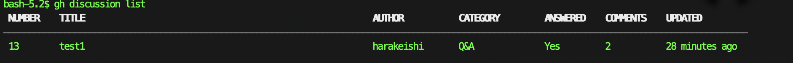
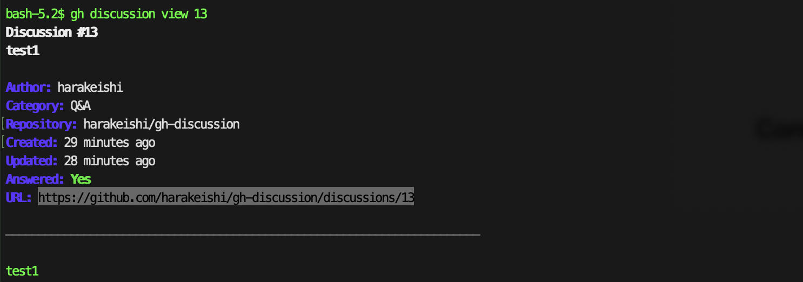
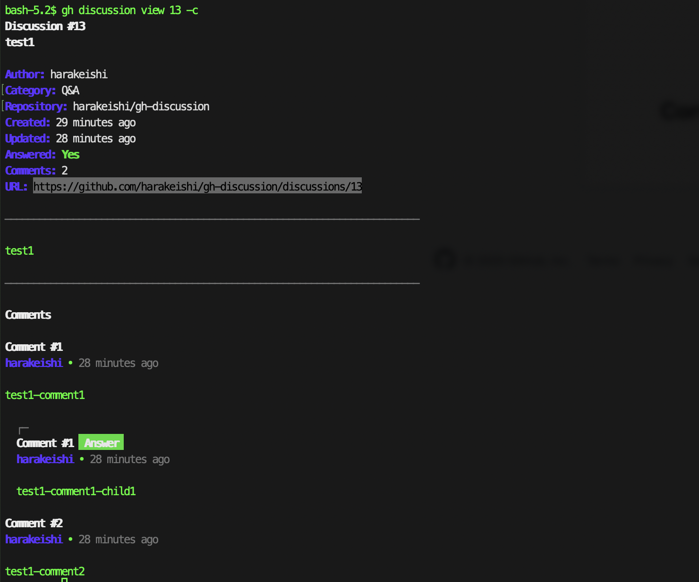

# gh-discussion

GitHub Discussionsを管理するためのGitHub CLI拡張機能で、`gh issue`や`gh pr`と同様の機能をGitHub Discussionsに提供します。

[English](README.md) | 日本語

## 機能

- **ディスカッションの一覧表示** - フィルタリングと検索機能付き
- **ディスカッションの詳細表示** - コメント表示オプション付き
- **ディスカッションの作成** - Webブラウザ連携
- **複数の出力形式**: テーブル、JSON、カスタムテンプレート
- **GitHub CLI統合**: 既存のGitHub認証を使用

## デモ

### ディスカッション一覧表示


### ディスカッション詳細表示


### ディスカッション詳細表示（コメント付き）


## インストール

### 前提条件

- [GitHub CLI](https://cli.github.com/) がインストール・認証済みであること
- Go 1.21以降（ソースからビルドする場合）

### ソースからインストール

```bash
git clone https://github.com/harakeishi/gh-discussion.git
cd gh-discussion
go build -o gh-discussion
gh extension install .
```

### GitHub CLI拡張機能としてインストール

```bash
gh extension install harakeishi/gh-discussion
```

## 使用方法

### ディスカッションの一覧表示

```bash
# 現在のリポジトリのディスカッションを一覧表示
gh discussion list

# 特定のリポジトリのディスカッションを一覧表示
gh discussion list -R owner/repo

# 作成者でフィルタリング
gh discussion list -a username

# ディスカッションを検索
gh discussion list -S "API documentation"

# カテゴリでフィルタリング
gh discussion list --category "General"

# 回答済み状況でフィルタリング
gh discussion list --answered true
gh discussion list --answered false

# 結果数を制限
gh discussion list -L 50

# 特定のフィールドをJSONで出力
gh discussion list --json "number,title,author,category,isAnswered"

# Webブラウザで開く
gh discussion list -w
```

### ディスカッションの詳細表示

```bash
# ディスカッション番号で表示
gh discussion view 123

# 特定のリポジトリのディスカッションを表示
gh discussion view 123 -R owner/repo

# URLでディスカッションを表示
gh discussion view https://github.com/owner/repo/discussions/123

# コメントも含めて表示
gh discussion view 123 -c

# 特定のフィールドを出力
gh discussion view 123 --json "title,body,author,comments"

# Webブラウザで開く
gh discussion view 123 -w
```

## 利用可能なJSONフィールド

### ディスカッションフィールド
- `activeLockReason`, `answer`, `answerChosenAt`, `answerChosenBy`
- `author`, `authorAssociation`, `body`, `bodyHTML`, `bodyText`
- `category`, `comments`, `createdAt`, `createdViaEmail`, `databaseId`
- `editor`, `id`, `includesCreatedEdit`, `isAnswered`, `lastEditedAt`
- `locked`, `number`, `publishedAt`, `reactionGroups`, `repository`
- `resourcePath`, `title`, `updatedAt`, `url`, `upvoteCount`
- `viewerCanDelete`, `viewerCanReact`, `viewerCanSubscribe`
- `viewerCanUpdate`, `viewerDidAuthor`, `viewerSubscription`

### ネストされたオブジェクトフィールド

#### 作成者/ユーザーフィールド
- `avatarUrl`, `login`, `url`, `id`, `name`, `email`

#### カテゴリフィールド
- `id`, `name`, `description`, `emoji`, `emojiHTML`, `isAnswerable`, `createdAt`, `updatedAt`

#### コメントフィールド
- `author`, `authorAssociation`, `body`, `bodyHTML`, `bodyText`, `createdAt`
- `id`, `isAnswer`, `isMinimized`, `minimizedReason`, `publishedAt`
- `reactionGroups`, `replies`, `replyTo`, `updatedAt`, `url`
- `viewerCanMarkAsAnswer`, `viewerCanUnmarkAsAnswer`

#### リポジトリフィールド
- `id`, `name`, `nameWithOwner`, `owner`, `url`, `description`

## 使用例

### 特定のカテゴリで未回答の質問を検索

```bash
gh discussion list --category "Q&A" --answered false --json "number,title,author,createdAt"
```

### 特定の作成者による最近のディスカッションを一覧表示

```bash
gh discussion list -a username -L 10 --json "number,title,createdAt,isAnswered"
```

## 開発

### プロジェクト構造

```
gh-discussion/
├── main.go                 # エントリーポイント
├── cmd/                    # コマンド実装
│   ├── list.go            # listコマンド
│   ├── view.go            # viewコマンド
│   └── create.go          # createコマンド
├── pkg/
│   ├── client/
│   │   └── github.go      # GraphQLクライアント
│   ├── models/
│   │   └── discussion.go  # データモデル
│   └── formatter/
│       └── output.go      # 出力フォーマット
├── go.mod
├── go.sum
└── README.md
```

### ビルド

```bash
go build -o gh-discussion
```

### テスト

```bash
go test ./...
```

## コントリビューション

1. リポジトリをフォーク
2. フィーチャーブランチを作成
3. 変更を実装
4. 必要に応じてテストを追加
5. プルリクエストを提出

## ライセンス

このプロジェクトはMITライセンスの下でライセンスされています。詳細はLICENSEファイルを参照してください。

## 謝辞

- GitHub CLIの`gh issue`と`gh pr`コマンドにインスパイアされました
- [GitHub CLI Go library](https://github.com/cli/go-gh)を使用して構築
- CLIフレームワークに[Cobra](https://github.com/spf/cobra)を使用 
